[TOC]

wamp，即Windows下安装Apache，PHP和MySQL。  
我是在win10下装了并没有很难，也没有遇到什么很大的问题。网上有不少教程，可惜都太老了。  

##先装PHP
1. 进入[http://windows.php.net/download/](http://windows.php.net/download/)，下载PHP的最新版本，截止到目前最新版本是5.6.14。  
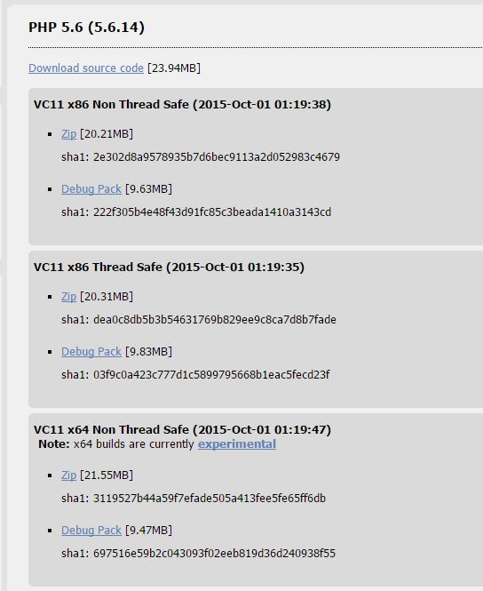  
 - 最上面的第一个选项(Download source code)是下载源代码，需要自己编译。
 - VC11 指的是用`visual studio 2011`编译好的，我们需要下载的就是编译过的。
 - X86 指的是微软的32位操作系统，X64 即64位操作系统。
 - Thread Safe值多线程安全，加上一个Non 即非多线程安全。
 - 2015-Oct-01 01:19:38 即发布日期，2015年十月一日

**在这里我选择的是第二个的Zip压缩包，即`VC11 X86 Thread Safe(2015-Oct-01 01:19:35)`**  

2. 下载之后直接解压，放在你电脑上的任何位置，在这里我是放在C盘的根目录下，所以最终安装路径`C:\PHP`
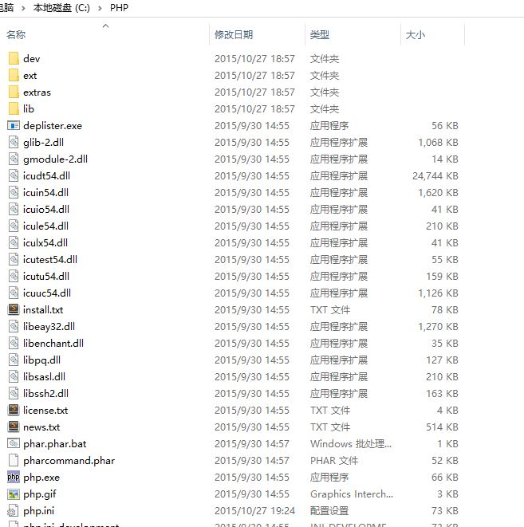

3. 将 PHP 的安装路径加入 PATH 环境变量，这样我们就可以在命令行里面使用PHP。（当然，如果你没有这个需求，也可以不用）
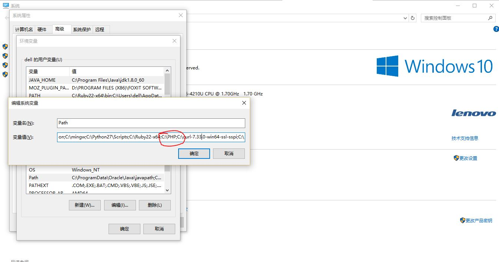

4. 进入 PHP 安装目录（例如 C:\php）。找到 php.ini-development 文件并复制一份到当前目录，重命名为 php.ini。
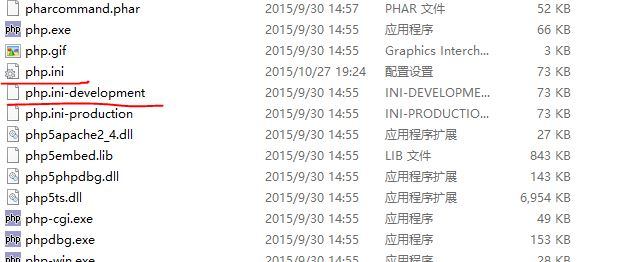

5. 用编辑器打开`php.ini`，修改以下配置
 - 去掉`extension=php_mbstring.dll`前面的分号（888行左右）
 - 去掉`extension=php_openssl.dll`前面的分号（893行左右）
 - 去掉`extension_dir = "ext"`前面的分号（736行左右）

##再装MySQL
1. 有两篇教程讲的非常详细，我也是按照他们的教程做的。
 - [如何在Windows上安装MySQL数据库服务器](http://zh.wikihow.com/%E5%9C%A8Windows%E4%B8%8A%E5%AE%89%E8%A3%85MySQL%E6%95%B0%E6%8D%AE%E5%BA%93%E6%9C%8D%E5%8A%A1%E5%99%A8)
 - [MySQL 5.6 for Windows 解压缩版配置安装](http://jingyan.baidu.com/article/f3ad7d0ffc061a09c3345bf0.html)
2. 其实也是正常的安装，下一步，下一步，完成。然后，把MySQL的bin加入环境变量，然后配置my.ini，如果你也是按照第一篇教程把`datadir`不是放在C盘，而且出了问题的话，可以看一下我的另一篇博客讲到了我遇到过的问题。
3. MySQL的启动是在管理员权限的cmd里，`net start mysql`启动，`net stop mysql`停止，我没有安装PHPmyadmin等MySQL的可视化操作，所以在一般的cmd下就可以`mysql -u username -p password`，当然`username`和`password`分别换成你自己的。

##最后Apache
1. 进入[http://httpd.apache.org/](http://httpd.apache.org/)，下载Apache的最新版本，截止到目前的最新版本是2.4.17。  
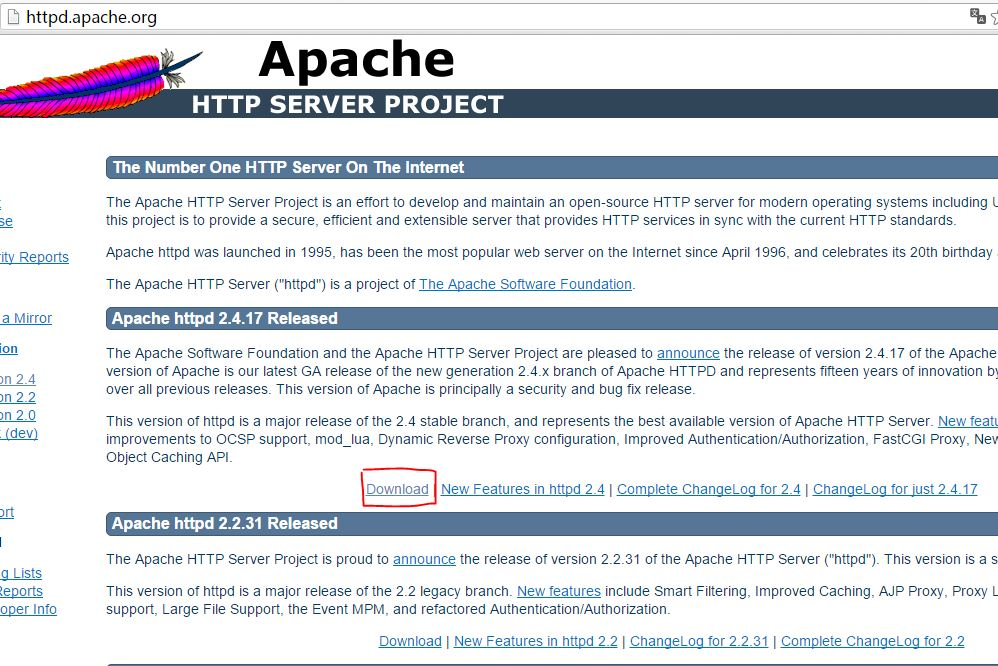

2. 进入下载页后选择`Files for Microsoft Windows`。  
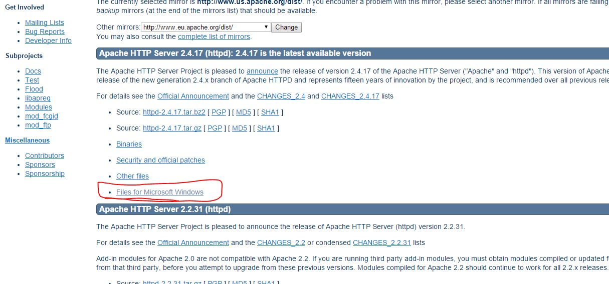

3. 因为apache本身不提供已编译的安装包，只提供源码，如果你自己无法编译，可以选择下面这些官方推荐的第三方提供编译的网站。其中后两个是有名的wamp以及xampp集成环境，因为我们只想下载apache，所以这里我们第一个ApacheHaus为例。  
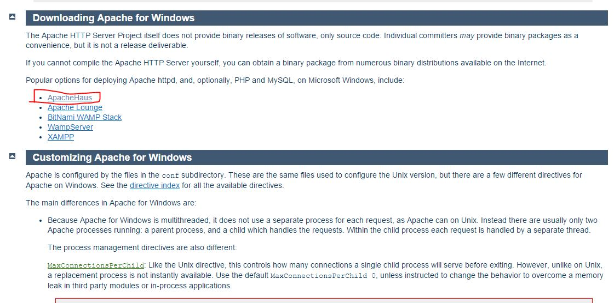

4. 这里也有很多的种类，`VC9`代表用`visual studio 2009`编译，`VC11`即`visual studio 2011`，这里我们选择第一个。`[Apache 2.4 VC9]`  
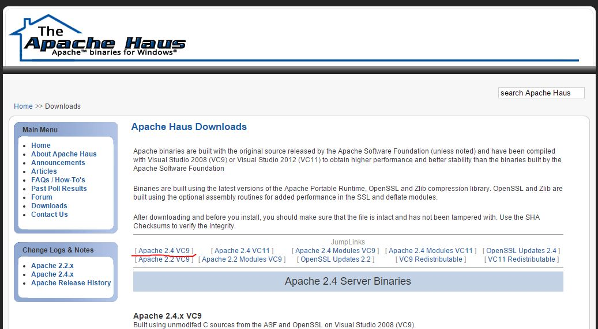

5. 为什么还没有给我下载，怎么会这么多步骤还不给我下载！  
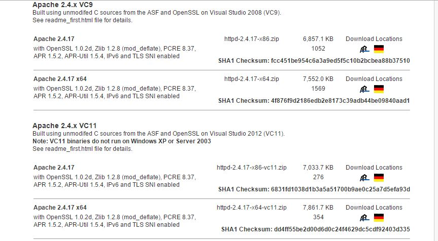

6. 终于下载完了，同样的下载的是一个压缩包，把它解压并放在你想放置的地方。在这里我是放在C盘的根目录下，所以最终的安装目录是`C:\Apache24`  

7. 以管理员身份运行cmd，进入Apache的bin目录下，执行`httpd -k install`,即可安装。其他的几个命令是`httpd -k stop`,`httpd -k restart`,`httpd -k uninstall`和`httpd -V`分别表示关闭,重启，卸载Apache服务器和查看Apache服务器版本信息，当然也是在管理员权限下的cmd里面，
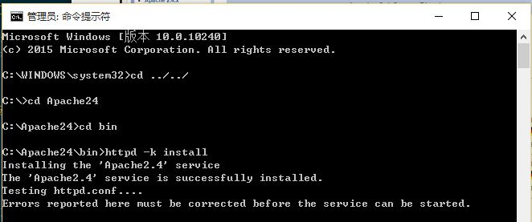
>不知道我的为什么安装出了一点问题，应该是httpd.conf还没有配置，不过可以看到Apache是安装成功了的。

8. 同样的把Apache的bin加入环境变量，而且在安装好了Apache之后，按下Windows键和R键，调出运行，输入`services.msc`即可以查看系统服务，看一下Apache有没有加进去，Apache也可以从这里打开。  
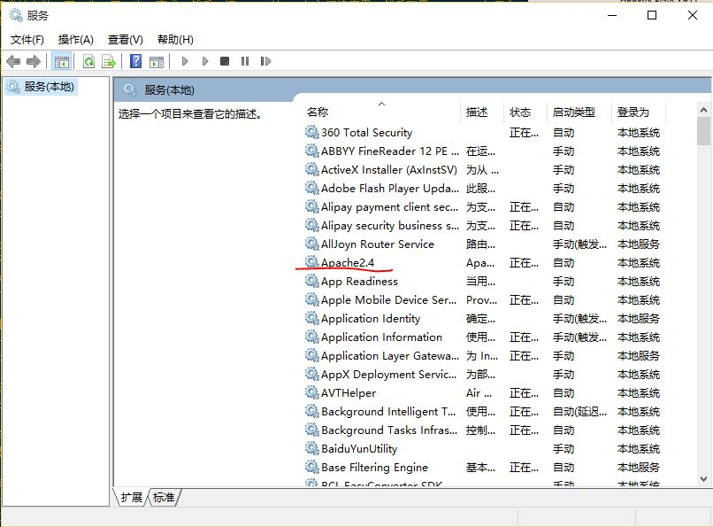  

9. 打开Apache，在浏览器中输入`localhost`即可以看到Apache的默认页面，即安装成功。
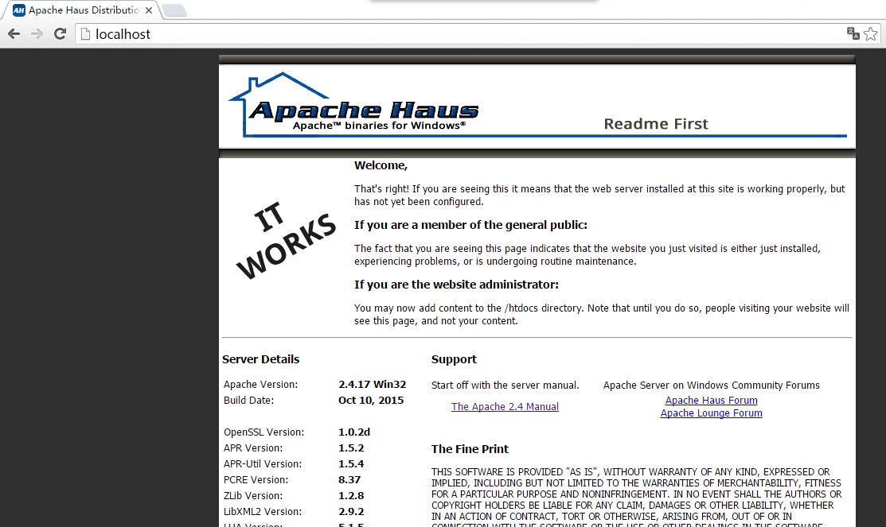

>Apache等http服务器，像IIS，nginx等都是占用80端口，如果Apache无法正常打开，你可以查看一下你的端口是否被占，可以在cmd下使用`netstat -a`来查看端口服务状态。


10. 最后的配置  
 1. 在Apache的conf下找到httpd.conf，用编辑器打开。  
 2. 找到`DirectoryIndex`，在这一行的最后加上`index.php`，最后的效果`DirectoryIndex   index.html index.php`，因为Apache的默认主页只有`index.html`我们给它加上`index.php`。（在286行左右）  
 3. 找到`LoadModule`，加上如下的代码。  
 ```php  
 LoadModule php5_module "c:/PHP/php5apache2_4.dll"  
 AddHandler application/x-httpd-php .php  
 PHPIniDir "C:/PHP"  
 ```  
 这是为了在Apache加入php模块，现在我们可以在Apache的htdocs目录下（这就是localhost的根目录），创建test.php,写下如下代码，在浏览器里打开，看能不能解析PHP。  
 ```php  
 <?php  
 echo "Install PHP Successful";  
 ?>  
 ```  
 如果是这样，即解析成功。   
 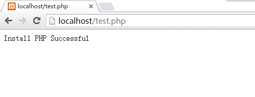   
 4. 接下来PHP连接数据库，因为在PHP中默认的MySQL扩展并没有打开，我们只需要将其打开就可以了。  
 再次打开php.ini，先找到`extension_dir`，找到所有扩展的存储地方，在PHP安装目录的下的ext文件夹里，所以我们加上这个路径就可以了，我的最终效果`extension_dir = "C:\PHP\ext"`（在736行左右），然后找到类似于这样的扩展语句`“;extension= php_mysql.dll”`把所有带有mysql的语句的前面的分号去掉就可以了。  
 现在我们在刚才的test.php里面加上连接数据库的语句。  
 ```php  
 echo "Install PHP Successful";  
 echo "<br>";  
 if($conn = mysqli_connect("localhost","XXX","XXX")){  
 	echo "Install MySQL Successful";  
 }else{  
 	echo "Install MySQL Failed";  
 }  
 ```  
 将上面的XXX分别换成你自己的数据库用户名和密码就可以了。如果出现的是如下界面，即安装成功。  
 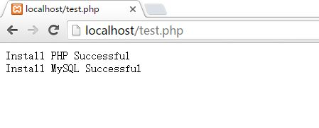  
  
那么到现在就全部安装完了，自己安装配置wamp有没有感觉很好呢？  

>装好Apache这些之后在Windows上怎么查看端口使用情况呢？在cmd里输入`netstat -ano`就可以看到电脑的端口使用情况以及相应进程的PID。

##顺带记录一下在Ubuntu下安装lamp的步骤  
**安装Apache**  
`$ sudo apt-get install apache2`  
安装好之后，配置文件应该位于/etc/apache2中，默认情况下无需修改即可使用。默认的网站目为/var/www/。  
启动Apache的方法为  
`$ sudo /etc/init.d/apache2 start`  
那么停止与重启就最后一个分别换成`stop`和`restart`就可以了。  
因为Apache也会自动加入系统服务，所以也可以这样写。  
`$ sudo service apache2 start`  
*测试*  
装好并启动 Apache 服务后，本地服务器应该就可以用了。可以利用curl访问 localhost 来测试：  
`$ curl localhost`  
Apache 的错误日志文件默认为`/var/log/apache2/error.log`。  
启动Apache的时候可能会出现如下警告：  
`apache2: Could not determine the server's fully qualified domain name, using 127.0.0.1 for ServerName`  
说明你没有指定`ServerName`,如果想去掉这个错误，可以修改`/etc/apache2/apache2.conf`文件：  
`$ sudo vi /etc/apache2/apache2.conf`  
添加如下行：  
`ServerName localhost`  
**安装PHP**  
`$ sudo apt-get install php5`  
执行之后，PHP 应该就已经部署完毕了。可以使用phpinfo()函数来测试 PHP 是否已经就绪：  
`$ sudo vi /var/www/phpinfo.php`  
在文件里输入：  
`<?php phpinfo(); ?>`  
然后`curl localhost/phpinfo.php`来查看。  
**安装PHP其他模块**  
`
$ sudo apt-get install php5-mysql php5-curl php5-gd php5-intl php-pear php5-imagick php5-imap php5-mcrypt php5-memcache php5-ming php5-ps php5-pspell php5-recode php5-snmp php5-sqlite php5-tidy php5-xmlrpc php5-xsl
`  
**安装MySQL**  
`$ sudo apt-get install mysql-server`  
**其他**  
1. 全局禁用 Index，这个配置在Windows下和Linux下是一样的  
Index 就是访问一个不存在 index.html、index.php 等文件的目录时服务器列出的文件列表，这样会对用户展示文件结构，如果想禁用，可以修改 Apache 的配置文件：  
`$ sudo vi /etc/apache2/apache2.conf`  
找到并修改为:  

```
<Directory /var/www/>
        Options -Indexes
        Options FollowSymLinks
        AllowOverride None
        Require all granted
</Directory>
```


##顺带记录一下在centos下安装lamp的过程  
**安装Apache**  
`$ yum install httpd httpd-devel `  
启动Apache  
`sudo  /etc/init.d/httpd start`  
或者`sudo service httpd start`  
**安装MySQL**  
`$ yum install mysql mysql-server`  
启动MySQL  
`sudo /etc/init.d/mysqld start`  
或者`sudo service mysqld start`  
**安装PHP**  
`$ yum install php php-devel`  
然后重启Apache使PHP生效。  
`sudo /etc/init.d/httpd restart`  
**安装PHP的扩展**  
`
yum install php-mysql php-gd php-imap php-ldap php-odbc php-pear php-xml php-xmlrpc
`  
安装完之后再次重启Apache。  


##参考链接
[在windows下搭建mysql,php,apache环境(3)-apache的部署](http://www.vimer.cn/2009/12/%E5%9C%A8windows%E4%B8%8B%E6%90%AD%E5%BB%BAmysqlphpapache%E7%8E%AF%E5%A2%833-apache%E7%9A%84%E9%83%A8%E7%BD%B2.html)  
[在windows下搭建mysql,php,apache环境(2)-php的部署](http://www.vimer.cn/2009/12/%E5%9C%A8windows%E4%B8%8B%E6%90%AD%E5%BB%BAmysqlphpapache%E7%8E%AF%E5%A2%832-php%E7%9A%84%E9%83%A8%E7%BD%B2.html)  
[在windows下搭建mysql,php,apache环境(1)-mysql的部署](http://www.vimer.cn/2009/12/%E5%9C%A8windows%E4%B8%8B%E6%90%AD%E5%BB%BAmysqlphpapache%E7%8E%AF%E5%A2%831-mysql%E7%9A%84%E9%83%A8%E7%BD%B2.html)  
[Microsoft Windows 下的 Apache 2.x](http://php.net/manual/zh/install.windows.apache2.php)  
[如何从Apache官网下载windows版apache服务器](http://jingyan.baidu.com/article/29697b912f6539ab20de3cf8.html)  
[MySQL 5.6 for Windows 解压缩版配置安装](http://jingyan.baidu.com/article/f3ad7d0ffc061a09c3345bf0.html)  
[如何在Windows上安装MySQL数据库服务器](http://zh.wikihow.com/%E5%9C%A8Windows%E4%B8%8A%E5%AE%89%E8%A3%85MySQL%E6%95%B0%E6%8D%AE%E5%BA%93%E6%9C%8D%E5%8A%A1%E5%99%A8)  
[在 Windows 上快速安装并运行 Laravel 5.x](http://www.golaravel.com/post/install-and-run-laravel-5-x-on-windows/)  
[Windows 7下安装配置PHP+Apache+Mysql的方法](http://jingyan.baidu.com/article/335530da5f5c5019cb41c3c2.html)  
[在CentOS上搭建PHP服务器环境](http://www.cnblogs.com/liulun/p/3535346.html)  
[Ubuntu 配置 Apache, MySQL, PHP 以及 phpMyAdmin 过程记录](https://www.renfei.org/blog/set-up-apache-mysql-php-phpmyadmin-on-ubuntu-server.html)  


