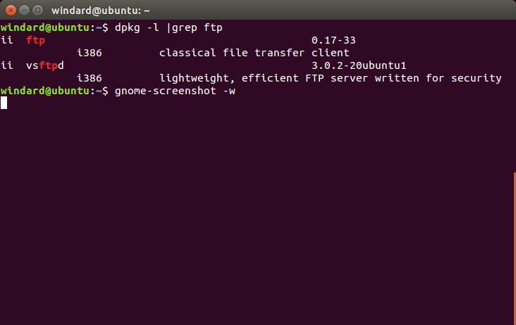

##在ubuntu上装vsftpd            

vsftpd即very security ftp，好吧，这样听起来还是似乎挺不错的样子。其实在ubuntu上是自带了一个ftp的客户端的，所以我们只需要一个ftp服务器段就可以了。                                
```sudo apt-get install vsftpd```                 
这样就装好了我们的vsftpd，用`dpkg`来看一下。                   
      


##启动与关闭
```service vsftpd start```                  
毫无疑问，这就是启动了。                         
```service vsftpd stop ```                  
关闭vsftpd服务器。             
还有两个命令就是`status`和`restart`分别用来查看vsftpd的状态和重启ftp服务器。    

##使用配置
```ftp localhost``` 进入命令行模式的ftp，可以使用匿名登录，也可以使用帐号登录。                                  
如果是匿名登录的话，帐号就是`anonymus`密码随意写就可以了，匿名用户登录之后的根目录在`/src/ftp`。                                     
帐号登录的话就是使用本机的帐号和密码登录,帐号密码登录的根目录就在`/home/账户名`。                              
还有一种登录方式就是使用虚拟账户登录，就是说为ftp设置一个专门用来登录的账户，并指定其根目录。                           
>使用虚拟账户登录就需要先创建一个虚拟账户，这个账户没有登录操作系统的权限，但是可以登录vsftpd                 
>`useradd vsftpd -s /sbin/nologin -m username`，此处的-s是指定shell，但是`/sbin/nologin`是一个无效的shell，创建了一个无法登录操作系统的用户，-m 指定根目录，所以该用户的根目录在`/home/username`                                                    

vsftpd主配置文件`/etc/vsftpd.conf`,主程序`/usr/sbin/vsftpd`,禁止使用vsftpd的用户列表`/etx/ftpusers`,允许使用vsftpd的用户列表`/etc/user_list`,匿名用户根目录`/src/ftp`,日志存储地址`/var/log/vsftpd.log`

vsftpd的主要配置文件在`/etc/vsftpd.conf`,接下来让我们看一下这个配置文件,英文注解都已略去。

```
listen=<YES/NO> :设置为YES时vsftpd以独立运行方式启动，设置为NO时以xinetd方式启动（xinetd是管理守护进程的，将服务集中管理，可以减少大量服务的资源消耗）                                                                        
listen_port=<port> :设置控制连接的监听端口号，默认为21                                          
listen_address=<ip address> :将在绑定到指定IP地址运行，适合多网卡                                                   
connect_from_port_20=<YES/NO> :若为YES，则强迫FTP－DATA的数据传送使用port 20，默认YES                                 
pasv_enable=<YES/NO> :是否使用被动模式的数据连接，如果客户机在防火墙后，请开启为YES                                
pasv_min_port=<n>                                                                                       
pasv_max_port=<m> :设置被动模式后的数据连接端口范围在n和m之间,建议为50000－60000端口                                          
message_file=<filename> :设置使用者进入某个目录时显示的文件内容，默认为 .message                                    
dirmessage_enable=<YES/NO> :设置使用者进入某个目录时是否显示由message_file指定的文件内容                            
ftpd_banner=<message> :设置用户连接服务器后的显示信息，就是欢迎信息                                          
banner_file=<filename> :设置用户连接服务器后的显示信息存放在指定的filename文件中                                 
connect_timeout=<n> :如果客户机连接服务器超过N秒，则强制断线，默认60                                                       
accept_timeout=<n> :当使用者以被动模式进行数据传输时，服务器发出passive port指令等待客户机超过N秒，则强制断线，默认60             
accept_connection_timeout=<n> :设置空闲的数据连接在N秒后中断，默认120                                     
data_connection_timeout=<n> : 设置空闲的用户会话在N秒后中断，默认300                                           
max_clients=<n> : 在独立启动时限制服务器的连接数，0表示无限制                                              
max_per_ip=<n> :在独立启动时限制客户机每IP的连接数，0表示无限制（不知道是否跟多线程下载有没干系）                                
local_enable=<YES/NO> :设置是否支持本地用户帐号访问                                            
guest_enable=<YES/NO> :设置是否支持虚拟用户帐号访问                                           
write_enable=<YES/NO> :是否开放本地用户的写权限                                            
local_umask=<nnn> :设置本地用户上传的文件的生成掩码，默认为077                                     
local_max_rate<n> :设置本地用户最大的传输速率，单位为bytes/sec，值为0表示不限制                          
local_root=<file> :设置本地用户登陆后的目录，默认为本地用户的主目录                                         
chroot_local_user=<YES/NO> :当为YES时，所有本地用户可以执行chroot                                   
chroot_list_enable=<YES/NO>                                                                                              
chroot_list_file=<filename> :当chroot_local_user=NO 且 chroot_list_enable=YES时，只有filename文件指定的用户可以执行chroot              
anonymous_enable=<YES/NO> :设置是否支持匿名用户访问                                   
anon_max_rate=<n> :设置匿名用户的最大传输速率，单位为B/s，值为0表示不限制                              
anon_world_readable_only=<YES/NO> 是否开放匿名用户的浏览权限                                   
anon_upload_enable=<YES/NO> 设置是否允许匿名用户上传                                   
anon_mkdir_write_enable=<YES/NO> :设置是否允许匿名用户创建目录                               
anon_other_write_enable=<YES/NO> :设置是否允许匿名用户其他的写权限（注意，这个在安全上比较重要，一般不建议开，不过关闭会不支持续传）      
anon_umask=<nnn> :设置匿名用户上传的文件的生成掩码，默认为077                                    
```


ftp数字码代表的意思：

```
110 重新启动标记应答。                                  
120 服务在多久时间内ready。                            
125 数据链路端口开启，准备传送。                                  
150 文件状态正常，开启数据连接端口。                              
200 命令执行成功。                                    
202 命令执行失败。                                    
211 系统状态或是系统求助响应。                                  
212 目录的状态。                                                
213 文件的状态。                                          
214 求助的讯息。                                             
215 名称系统类型。                                       
220 新的联机服务ready。                                            
221 服务的控制连接端口关闭，可以注销。                                 
225 数据连结开启，但无传输动作。                                       
226 关闭数据连接端口，请求的文件操作成功。                                              
227 进入passive mode。                                               
230 使用者登入。                                              
250 请求的文件操作完成。                                           
257 显示目前的路径名称。                                    
331 用户名称正确，需要密码。                                           
332 登入时需要账号信息。                                     
350 请求的操作需要进一部的命令。                                    
421 无法提供服务，关闭控制连结。                                   
425 无法开启数据链路。                                  
426 关闭联机，终止传输。                                   
450 请求的操作未执行。                                    
451 命令终止:有本地的错误。                                     
452 未执行命令:磁盘空间不足。                                
500 格式错误，无法识别命令。
501 参数语法错误。
502 命令执行失败。
503 命令顺序错误。
504 命令所接的参数不正确。
530 未登入。                              
532 储存文件需要账户登入。                                          
550 未执行请求的操作。                                      
551 请求的命令终止，类型未知。                                        
552 请求的文件终止，储存位溢出。                                            
553 未执行请求的的命令，名称不正确。                                           
```          


ftp命令：

```
ftp XX.XX.XX.XX        #连接目标主机
open host  [port]      #进入ftp模式，连接目标主机
user XXX		       #切换用户
close|disconnect       #停止连接目标主机，进入ftp模式
bye|quit|!|exit        #退出ftp状态
！ XX			       #在自己的主机上执行XX命令
?|help [某个命令]	   #查看ftp帮助
ls|dir			       #查看ftp当前目录下文件
cd				       #ftp切换目录
lcd				       #在自己主机上切换目录
cdup			       #ftp进入父级目录
pwd				       #ftp当前目录
ascii			       #设置文件传输为ascii模式
binary|bi		       #设置文件传输为二进制模式
delete			       #删除ftp上文件
mkdir			       #在ftp上创建文件夹
get|recv XXX [XX]      #下载ftp服务器上的XXX文件，并以XX文件名保存在自己主机当前目录
put|send XX [XXX]      #上传自己主机当前目录下的XX文件，并以XXX文件名保存在ftp服务器上
mput                   #大量文件上传，ftp支持通配符×
mget			       #大量文件下载，ftp支持通配符×
status			       #当前ftp状态
system			       #查看ftp服务器主机
chmod				   #改变ftp服务器上文件权限
rename                 #改变ftp服务器上的某个文件名
size				   #查看ftp上某个文件大小
```
